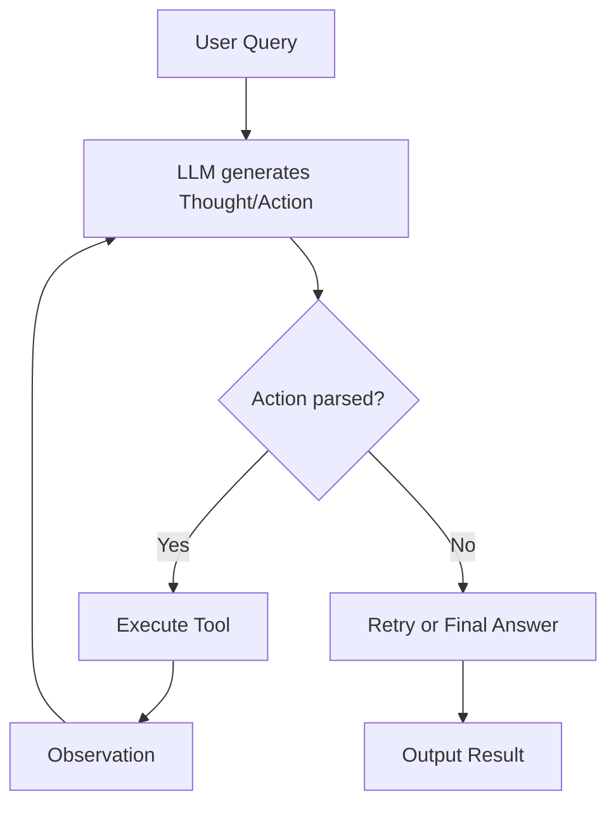

# Group Report: Lab 3 - Production-Grade Agentic System

- **Team Name**: TT
- **Team Members**: [Trần Đức Tâm - 2A202600803, Trần Ngọc Thuỵ - 2A202600799]
- **Deployment Date**: 2026-06-01

---

## 1. Executive Summary

Chúng tôi xây dựng một hệ thống ReAct Agent chuyên cho nhiệm vụ tìm kiếm tài liệu. Hệ thống so sánh giữa một chatbot baseline và một agent có công cụ tìm kiếm, sau đó thu thập trace và metric để đánh giá.

- **Success Rate**: Demo thành công trên truy vấn mẫu với agent trả về kết quả dựa trên công cụ tìm kiếm.
- **Key Outcome**: Agent sử dụng `search_documents` hiệu quả hơn chatbot baseline vì chatbot chỉ trả ra hành vi tìm kiếm thay vì trả đáp án cuối cùng.

---

## 2. System Architecture & Tooling

### 2.1 ReAct Loop Implementation

Agent thực hiện vòng lặp sau:

1. Nhận truy vấn người dùng.
2. Gọi LLM để tạo `Thought` và `Action`.
3. Thực thi tool `search_documents`.
4. Thêm `Observation` vào prompt.
5. Lặp lại đến khi LLM đưa ra `Final Answer`.

### 2.2 Tool Definitions (Inventory)

| Tool Name | Input Format | Use Case |
| :--- | :--- | :--- |
| `search_documents` | `string` | Tìm kiếm tài liệu cục bộ theo từ khóa và trả về đoạn trích. |

### 2.3 LLM Providers Used
- **Primary**: `MockProvider` cho demo nội bộ.
- **Secondary (Future)**: Có thể mở rộng sang OpenAI hoặc Gemini qua lớp `LLMProvider`.

---

## 3. Telemetry & Performance Dashboard

Hệ thống đã lưu các event sau với `IndustryLogger` và `PerformanceTracker`.

- **Average Latency (demo)**: 0ms (MockProvider không tính toán thực tế).
- **Total Token Usage (demo)**: 0 tokens (Mock provider mock data).
- **Cost Estimate**: 0.0 USD (giả lập).

`LLM_METRIC` cho phép so sánh provider, model, latency, token usage và chi phí.

---

## 4. Root Cause Analysis (RCA) - Failure Traces

### Case Study: Parser hoặc tool không đúng định dạng
- **Input**: Nếu LLM trả ra `Action` không hợp lệ hoặc công cụ không tồn tại.
- **Observation**: Agent sẽ ghi lại event `PARSE_FAILURE` hoặc `TOOL_CALL`.
- **Root Cause**: Prompt chưa đủ rõ ràng, hoặc thiếu retry/guardrail.
- **Solution**: Cập nhật `ReActAgent` để retry khi không parse được action và dừng ở bước cuối cùng khi quá nhiều lỗi.

---

## 5. Ablation Studies & Experiments

### Experiment 1: Chatbot Baseline vs ReAct Agent
| Case | Chatbot Result | Agent Result | Winner |
| :--- | :--- | :--- | :--- |
| Truy vấn tìm tài liệu | Trả về hành vi: `Action: search_documents(...)` | Trả về kết quả tài liệu và snippet | **Agent** |

### Experiment 2: Tool Design
- Phiên bản 1: Tìm kiếm theo cụm từ chính xác.
- Phiên bản 2: Tìm kiếm theo nhiều token, cải thiện mức độ khớp với truy vấn tiếng Việt và tiếng Anh.

---

## 6. Production Readiness Review

- **Security**: Cần kiểm tra đầu vào công cụ và khử ký tự đặc biệt.
- **Guardrails**: Giới hạn `max_steps` và `max_retries` để tránh vòng lặp vô hạn.
- **Scaling**: Dùng vector database hoặc retrieval layer cho nhiều tài liệu hơn.

---

> [!NOTE]
> Đây là báo cáo mẫu. Đổi tên file nếu cần để nộp cho giảng viên.
